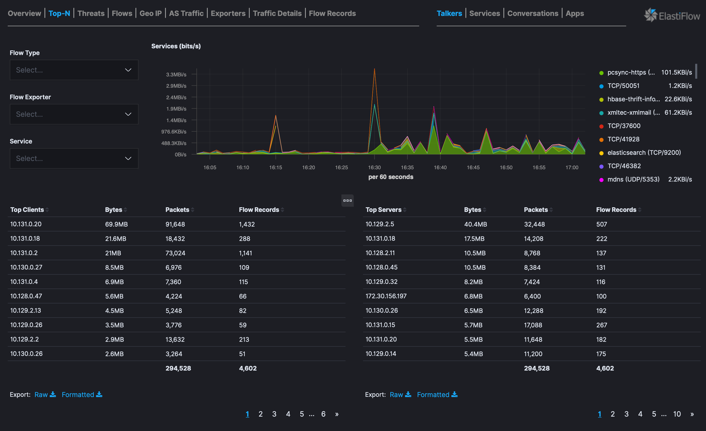
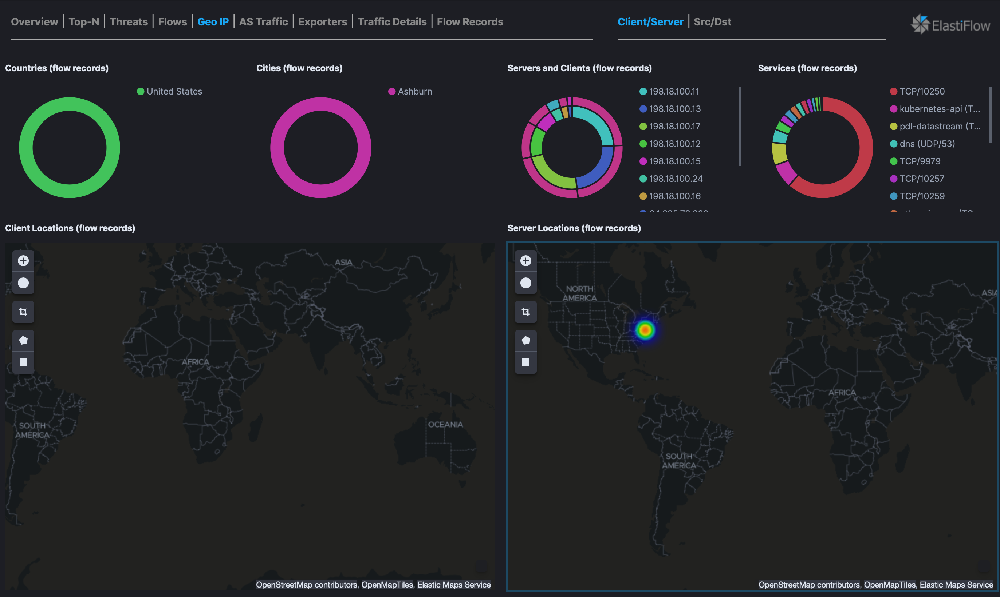
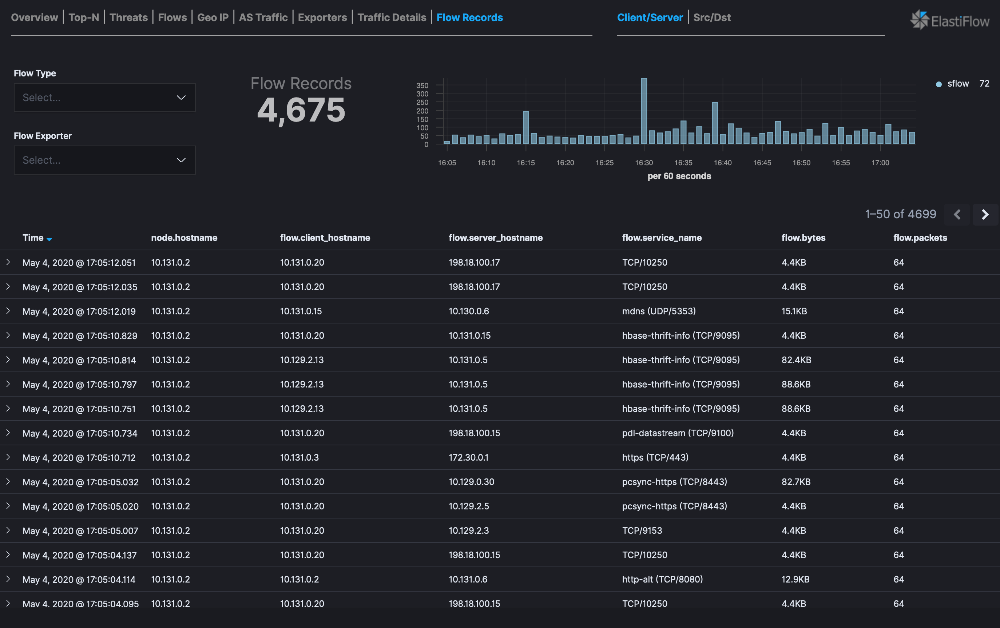

# NetFlows/SFlows visualization on OpenShift
```
NOTE: This is an experimental upstream procedure for visualizing
NetFlow/SFlow on OpenShift 4.4.x using OVN Kubernetes native
capabilities and ElastiFlow.
```

## Deployment of ElastiFlow on OCP
- Create project or namespace
    ```
    oc new-project netflow
    ```
- Create a 100Mi RWO PersistentVolume (PV) named `elastiflow-es-pv`
    ```
    NOTE: Update the example to match your environment

    oc create -f 01.1_elastiflow-pv.yaml
    ```
- Create a PersistentVolumeClaim (PVC) named `elastiflow-es-pvc`
    ```
    oc create -f 01.2_elastiflow-pvc.yaml
    ```
- Create the deployment for ElasticSearch. (NOTE: It will take several minutes for the Pods to be ready)
    ```
    oc create -f 01.3_elastiflow-logstash-deployment.yaml
    ```
- Create the deployment for Kibana
    ```
    oc create -f 02_elastiflow-kibana-deployment.yaml
    ```
- Create the deployment for LogStash
    ```
    oc create -f 03_elastiflow-logstash-deployment.yaml
    ```
- Validate all the services are running
    ```
    # oc get all
    NAME                                       READY   STATUS    RESTARTS   AGE
    pod/elastiflow-es-859845dc9c-z7rbf         1/1     Running   0          94m
    pod/elastiflow-kibana-675f4f5cc7-27l8p     1/1     Running   0          60m
    pod/elastiflow-logstash-5988b77cfb-kc4jj   1/1     Running   0          14s

    NAME                          TYPE        CLUSTER-IP       EXTERNAL-IP   PORT(S)                      AGE
    service/elastiflow-es         ClusterIP   172.30.156.197   <none>        9200/TCP                     19h
    service/elastiflow-kibana     ClusterIP   172.30.129.51    <none>        5601/TCP                     19h
    service/elastiflow-logstash   ClusterIP   172.30.241.108   <none>        4739/UDP,2055/UDP,6343/UDP   18h

    NAME                                  READY   UP-TO-DATE   AVAILABLE   AGE
    deployment.apps/elastiflow-es         1/1     1            1           94m
    deployment.apps/elastiflow-kibana     1/1     1            1           60m
    deployment.apps/elastiflow-logstash   1/1     1            1           14s

    NAME                                             DESIRED   CURRENT   READY   AGE
    replicaset.apps/elastiflow-es-859845dc9c         1         1         1       94m
    replicaset.apps/elastiflow-kibana-675f4f5cc7     1         1         1       60m
    replicaset.apps/elastiflow-logstash-5988b77cfb   1         1         1       14s

    NAME                                         HOST/PORT                                               PATH   SERVICES            PORT   TERMINATION   WILDCARD
    route.route.openshift.io/elastiflow-kibana   elastiflow-kibana-netflow.apps.ocp4poc.lab.shift.zone          elastiflow-kibana   5601                 None
    ```

## Load the Dashboard configurations into Kibana
- Download the dashboards configuration to local machine
```
curl -O https://raw.githubusercontent.com/robcowart/elastiflow/master/kibana/elastiflow.kibana.7.5.x.ndjson
```

- Access Kibana (using the Route) and load the Dashboard configuration (e.g. http://elastiflow-kibana-netflow.apps.ocp4poc.example.com)
```
Management > Saved Objects > Import > [ Import Saved Objects ]
```

## Enable SFlow on OVN Kubernetes
```
[root@bastion netflow]# oc get svc
NAME                  TYPE        CLUSTER-IP       EXTERNAL-IP   PORT(S)             AGE
elastiflow-es         ClusterIP   172.30.156.197   <none>        9200/TCP            19m
elastiflow-kibana     ClusterIP   172.30.129.51    <none>        5601/TCP            17m
elastiflow-logstash   ClusterIP   172.30.241.108   <none>        4739/TCP,2055/TCP,6343/TCP   44s
```

```
[root@bastion netflow]# oc get pods -n openshift-ovn-kubernetes -o wide --selector="app=ovs-node"
NAME             READY   STATUS    RESTARTS   AGE     IP              NODE       NOMINATED NODE   READINESS GATES
ovs-node-4hldj   1/1     Running   0          2d12h   198.18.100.16   worker-1   <none>           <none>
ovs-node-bd9ln   1/1     Running   0          2d12h   198.18.100.12   master-1   <none>           <none>
ovs-node-csz9q   1/1     Running   0          2d12h   198.18.100.13   master-2   <none>           <none>
ovs-node-qh4nv   1/1     Running   0          2d12h   198.18.100.15   worker-0   <none>           <none>
ovs-node-rsfk4   1/1     Running   0          2d12h   198.18.100.17   worker-2   <none>           <none>
ovs-node-zndhs   1/1     Running   0          2d12h   198.18.100.11   master-0   <none>           <none>
```

```
oc exec -ti ovs-node-rsfk4 -n openshift-ovn-kubernetes /bin/bash

export COLLECTOR_IP=172.30.241.108  # SFlow collector
export COLLECTOR_PORT=6343          # SFlow collector port
export AGENT_IP=ovn-k8s-mp0         # Node source (in this case ovn-k8s-mp0 is the management interface of OVN K8s in the Node)
export HEADER_BYTES=128
export SAMPLING_N=64
export POLLING_SECS=10
export OVS_BRIDGE=br-int            # OVN Kubernetes has multiple bridges based on features enabled. br-int is where all the Pods connects

ovs-vsctl -- --id=@sflow create sflow agent=${AGENT_IP} \
    target="\"${COLLECTOR_IP}:${COLLECTOR_PORT}\"" header=${HEADER_BYTES} \
    sampling=${SAMPLING_N} polling=${POLLING_SECS} \
    -- set bridge ${OVS_BRIDGE} sflow=@sflow

ovs-vsctl list sflow
```

```
# To stop capture
ovs-vsctl remove bridge ${OVS_BRIDGE} sflow <sFlow UUID>
```
## Screenshots

Screenshot of running this deployment on OpenSHift 4.4.3 with single worker as exporter.










## References

Work based on Elastiflow Dashbaords
- https://github.com/robcowart/elastiflow#provided-dashboards

## Additional NetFlow references 
Container traffic visibility library based on eBPF
- https://github.com/ntop/libebpfflow

Cloudflare high-scalability sFlow/NetFlow/IPFIX collector
- https://github.com/cloudflare/goflow

The Top 14 Netflow Open Source Projects
- https://awesomeopensource.com/projects/netflow
